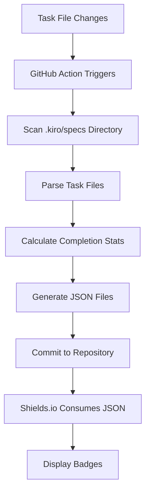
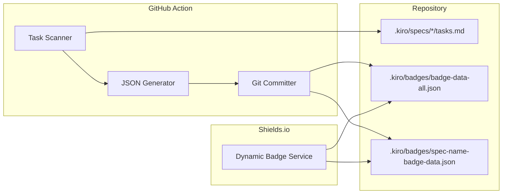

# Design Document

## Overview

The GitHub Kiro Static Badge system is a GitHub Action that automatically scans Kiro task files within a repository, generates JSON data compatible with Shields.io's dynamic badge service, and commits the JSON files to the repository. This enables developers to display both global and per-spec task completion badges in their documentation.

The system leverages Shields.io's dynamic JSON badge feature, which consumes JSON files from raw GitHub URLs to generate SVG badges. By committing static JSON files to the repository, we eliminate the need for hosting a live endpoint while ensuring badges stay current through automated GitHub Action triggers.

## Architecture

### High-Level Flow



### Component Architecture



## Components and Interfaces

### 1. Task Scanner Component

**Purpose**: Recursively scan the `.kiro/specs` directory to find and parse task files.

**Interface**:
```typescript
interface TaskScanner {
  scanAllSpecs(): Promise<SpecTaskData[]>
  scanSingleSpec(specName: string): Promise<TaskData>
}

interface SpecTaskData {
  specName: string
  taskData: TaskData
}

interface TaskData {
  totalTasks: number
  completedTasks: number
  completionRate: number
}
```

**Implementation Details**:
- Uses Node.js `fs` module to recursively traverse `.kiro/specs`
- Identifies `tasks.md` files within each spec directory
- Parses markdown checkbox syntax: `- [x]` (completed) and `- [ ]` (incomplete)
- Handles nested task hierarchies (e.g., `1.1`, `1.2` sub-tasks)
- Gracefully handles malformed or missing files

### 2. JSON Generator Component

**Purpose**: Convert task completion data into Shields.io-compatible JSON format.

**Interface**:
```typescript
interface JSONGenerator {
  generateGlobalBadge(allSpecs: SpecTaskData[]): BadgeJSON
  generateSpecBadge(specName: string, taskData: TaskData): BadgeJSON
}

interface BadgeJSON {
  schemaVersion: 1
  label: string
  message: string
  color: string
}
```

**Shields.io JSON Format**:
```json
{
  "schemaVersion": 1,
  "label": "Kiro Tasks",
  "message": "5/10",
  "color": "yellow"
}
```

**Color Logic**:
- `brightgreen`: 100% completion
- `yellow`: 1-99% completion  
- `red`: 0% completion

### 3. Git Committer Component

**Purpose**: Commit generated JSON files to the repository using GitHub Actions bot credentials.

**Interface**:
```typescript
interface GitCommitter {
  commitBadgeFiles(files: BadgeFile[]): Promise<void>
}

interface BadgeFile {
  path: string
  content: string
}
```

**File Locations**:
- Global badge: `.kiro/badges/badge-data-all.json`
- Individual spec badges: `.kiro/badges/{spec-name}-badge-data.json`

### 4. GitHub Action Wrapper

**Purpose**: Orchestrate the entire process and handle GitHub Actions-specific concerns.

**Responsibilities**:
- Parse action inputs
- Set up authentication
- Coordinate component execution
- Handle errors and logging
- Configure git user for commits

## Data Models

### Task File Format

The system expects Kiro task files to follow this markdown format:

```markdown
# Implementation Plan

- [ ] 1. First task
  - Description and requirements
  - _Requirements: 1.1, 2.3_

- [x] 2. Second task (completed)
  - This task is done
  - _Requirements: 1.2_

- [ ] 2.1 Sub-task of second task
  - Sub-tasks are also counted
  - _Requirements: 2.1_
```

### Badge JSON Schema

```json
{
  "$schema": "http://json-schema.org/draft-07/schema#",
  "type": "object",
  "properties": {
    "schemaVersion": {
      "type": "integer",
      "const": 1
    },
    "label": {
      "type": "string"
    },
    "message": {
      "type": "string",
      "pattern": "^\\d+/\\d+$"
    },
    "color": {
      "type": "string",
      "enum": ["brightgreen", "yellow", "red"]
    }
  },
  "required": ["schemaVersion", "label", "message", "color"]
}
```

## Error Handling

### File System Errors
- **Missing .kiro/specs directory**: Generate badges with 0/0 tasks
- **Unreadable task files**: Log warning and skip file, continue processing others
- **Permission errors**: Fail action with clear error message

### Git Errors
- **Commit failures**: Retry once, then fail with detailed error
- **Authentication issues**: Provide clear guidance on token permissions
- **Merge conflicts**: Use force push for badge files (they're generated, not manually edited)

### Parsing Errors
- **Malformed markdown**: Skip malformed tasks, log warnings
- **Invalid checkbox syntax**: Treat as incomplete task
- **Empty files**: Count as 0 tasks

### GitHub Actions Errors
- **Missing permissions**: Fail early with permission requirements
- **API rate limits**: Implement exponential backoff
- **Network issues**: Retry with timeout

## Testing Strategy

### Unit Tests
- **Task Scanner**: Test parsing various markdown formats, edge cases
- **JSON Generator**: Verify correct JSON structure and color logic
- **Git Committer**: Mock git operations, test error scenarios

### Integration Tests
- **End-to-end workflow**: Test complete action with sample repository
- **File system integration**: Test with various directory structures
- **Git integration**: Test commits and authentication

### Test Data
```
test-fixtures/
├── valid-tasks.md          # Standard task file
├── empty-tasks.md          # Empty file
├── malformed-tasks.md      # Invalid syntax
├── nested-tasks.md         # Complex hierarchy
└── mixed-completion.md     # Partially completed
```

### GitHub Actions Testing
- **Matrix testing**: Test on ubuntu-latest
- **Permission testing**: Test with minimal and full permissions
- **Trigger testing**: Test on push, pull_request, and schedule triggers

## Implementation Notes

### Action Metadata (action.yml)
```yaml
name: 'Kiro Task Badge Generator'
description: 'Generate Shields.io compatible JSON badges for Kiro task completion'
inputs:
  token:
    description: 'GitHub token for committing files'
    required: false
    default: ${{ github.token }}
  commit-message:
    description: 'Commit message for badge updates'
    required: false
    default: 'Update Kiro task completion badges'
runs:
  using: 'node24'
  main: 'dist/index.js'
```

### Workflow Triggers
```yaml
on:
  push:
    paths:
      - '.kiro/specs/**/tasks.md'
  pull_request:
    paths:
      - '.kiro/specs/**/tasks.md'
  workflow_dispatch:
```

### Badge Usage Examples

**Global Badge**:
```markdown

```

**Spec-specific Badge**:
```markdown

```